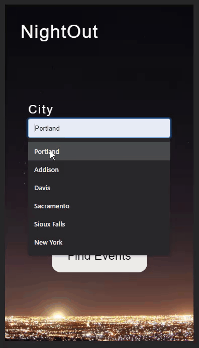

# NightOut

A front-end javaScript application to look up events and breweries by city and state.

## Technologies Used

- Bootstrap 4
- HTML5
- CSS3
- JavaScript
- jQuery

## Live Demo

Try the application live at [https://michaelpoolelf.github.io/api-hackathon/](https://michaelpoolelf.github.io/api-hackathon/)

## Features

- Users can view the form to input city and state.
- Users can submit the form and retrieve event and brewery data.
- Users can click on events and breweries to get more information.
- Users can return to the form page and make a new entry.

## Preview



## Development

### System Requirements

- Node.js 10 or higher
- NPM 6 or higher
- MongoDB 4 or higher

### Getting Started

1. Clone the repository.

    ```shell
    git clone https://github.com/Learning-Fuze/sgt-react
    cd sgt-react
    ```

1. Install all dependencies with NPM.

    ```shell
    npm install
    ```

1. Import the example database to MongoDB.

    ```shell
    mongoimport --db sgt-react database/dump.json
    ```

1. Start the project. Once started you can view the application by opening http://localhost:3000 in your browser.

    ```shell
    npm run dev
    ```
